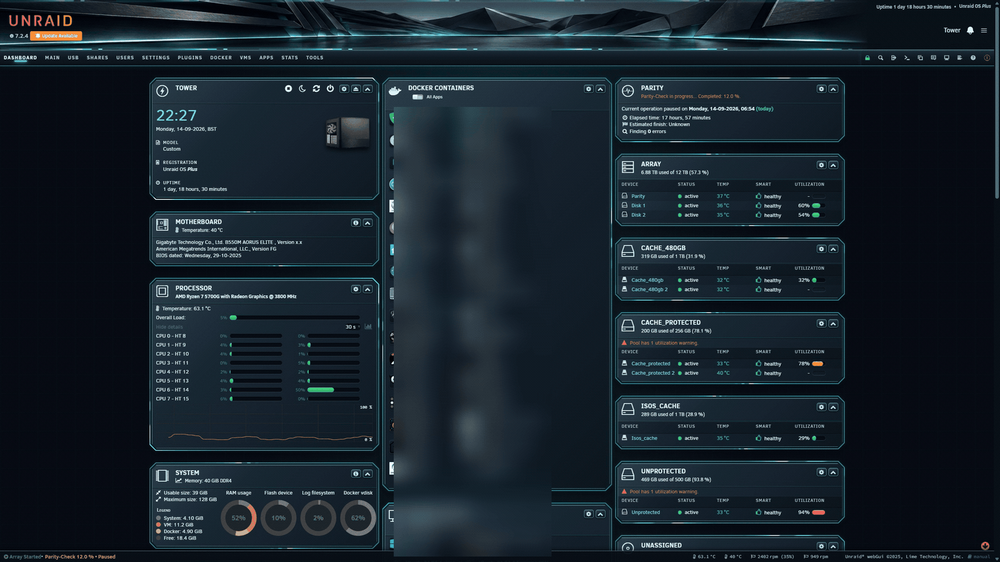
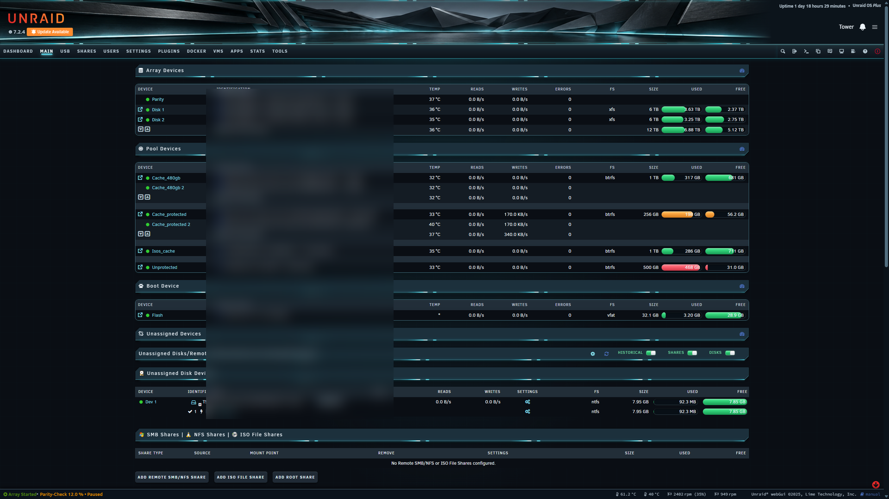
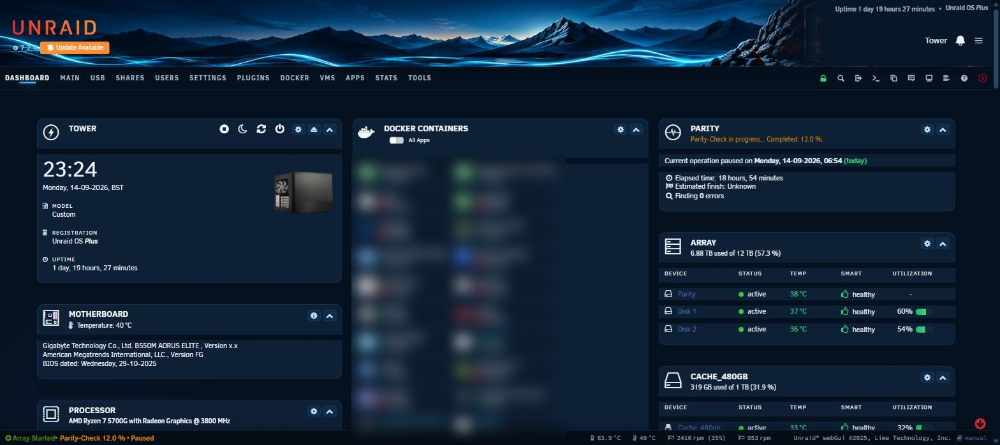
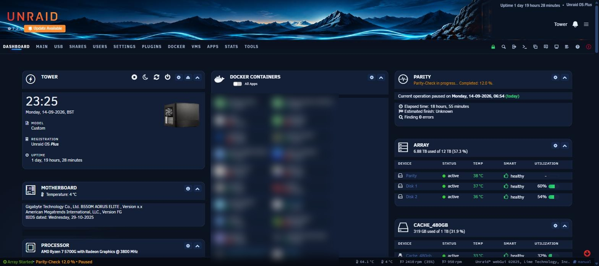

# Unraid themes

Four dark themes for the **Unraid 7.2.x** webGUI, each packaged as a standard Unraid plugin so they
install from the *Plugins* tab and can be listed in Community Applications.

CSS only. No scripts, no PHP, no page templates, no containers, no services — each one replaces the
Dynamix **Black** theme stylesheet and nothing else, and restores the original on uninstall.

| Theme | Look | Motion |
|---|---|---|
| **[TITANIUM](titanium/)** | Deep navy, cyan energy rails, ring-framed cards | animated |
| **[TITANIUM STILL](titanium-still/)** | Identical to TITANIUM, every animation paused | none |
| **[NAVY](navy/)** | Modern dark navy with cyan accents | none |
| **[REFORGED](reforged/)** | Deeper ground, electric-blue accents | none |

Each theme folder carries its **own banner artwork** (`banner.png`) — the one it was designed and
captured with. The banner is a separate Unraid setting, so themes never overwrite yours; copy it in
yourself if you want the matching look.

## TITANIUM


The rails and card rings really move — that GIF is the theme running on a live server.
[Main page animation →](titanium/main.gif)

## TITANIUM STILL


## NAVY


## REFORGED


## Install any of them

*Plugins → Install Plugin*, paste the matching URL:

```
https://raw.githubusercontent.com/GaBoNtZ/unraid-themes/main/titanium/titanium-theme.plg
https://raw.githubusercontent.com/GaBoNtZ/unraid-themes/main/titanium-still/titanium-still-theme.plg
https://raw.githubusercontent.com/GaBoNtZ/unraid-themes/main/navy/navy-theme.plg
https://raw.githubusercontent.com/GaBoNtZ/unraid-themes/main/reforged/reforged-theme.plg
```

Then select the **Black** theme in *Settings → Display Settings* and hard-refresh (Ctrl+F5).

**Install only one at a time** — all four write to `themes/black.css`, so the last one installed
wins. Removing a theme restores the stock stylesheet, which ships inside every plugin.

## What they share

- Page gutters that stay visible instead of collapsing on narrower windows
- Wide tables scroll inside their own box, so the page never scrolls sideways
- Banner handling that works with **any** artwork (fills the header, crops to fit; phones get the
  whole strip)
- Mobile pass: themed panels, device tables that reflow to the screen, contained Community
  Applications layout, and controls iOS can't repaint with native chrome
- Themed SweetAlert dialogs, jGrowl toasts, Unassigned Devices tables, Community Applications
  surfaces and the unraid-ui web components (notifications panel, header strip)
- Unraid's own green / orange / red threshold colours preserved on every usage bar

## Rolling back

Every plugin ships the pristine stock stylesheet and restores it on removal. A copy also lives here
as [`black.css.stock`](black.css.stock) if you ever need it by hand:

```
cp black.css.stock /usr/local/emhttp/plugins/dynamix/styles/themes/black.css
```

## Compatibility

Built and verified on **Unraid 7.2.4**; `min="7.0.0"`. Lime Tech moves selectors between releases,
so re-check the look after a major OS upgrade.

## Community Applications

The plugins already carry the metadata CA needs (`pluginURL`, `support`, `icon`, `<CHANGES>`,
`min`, dated versions). To get them listed, request inclusion in the CA feed via the Community
Applications support thread on the Unraid forums, pointing at this repo.

---

Unraid® is a trademark of Lime Technology, Inc. These themes are unofficial and unaffiliated.
